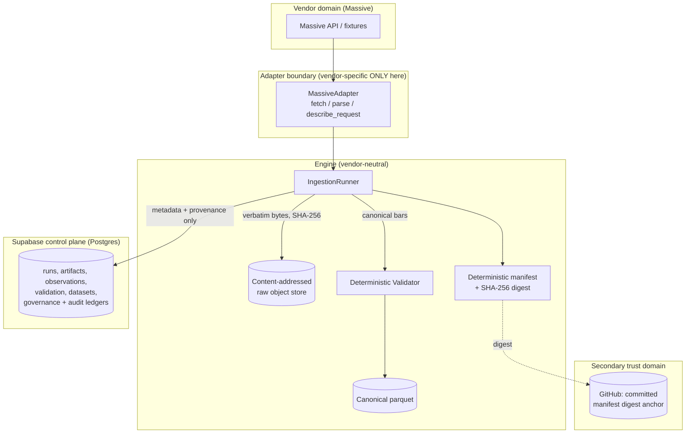
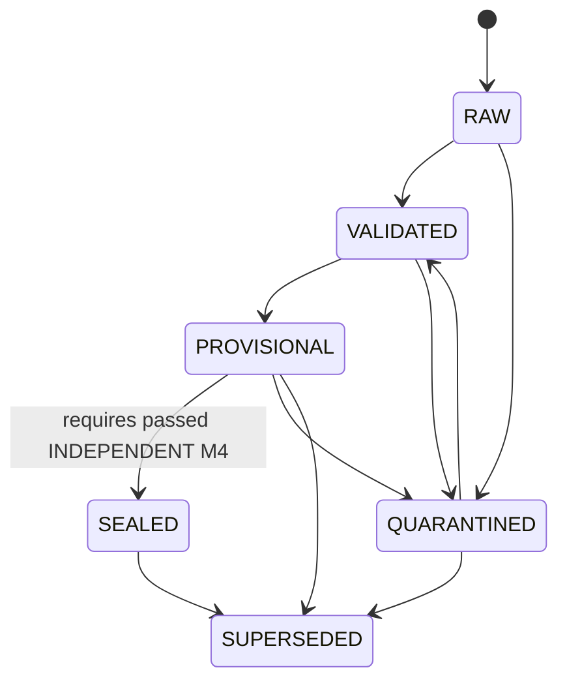

# M0 — Vendor & Infrastructure Foundation

This document describes **what is actually implemented** in M0. Anything marked
*deferred* is intentionally not built yet.

M0 establishes trustworthy data provenance: deterministic validation,
reproducibility, and a strict separation between raw vendor data and any
downstream research output. It implements **no** strategy logic, momentum,
portfolio construction, backtesting, optimization, or execution.

> **Status.** *M0 Foundation* is complete and proven against a real Postgres
> control plane using deterministic fixtures. *M0 Integration* (live Massive,
> Supabase Storage, and the Massive vendor-semantics ADR-0009) has code in place
> but its live evidence is **pending vendor/Supabase credentials** — see §15.
> Nothing here presents fixture output as live proof. Proof drivers by scope:
> `scripts/prove_m0.py` (local fixture proof, Postgres), `scripts/verify_infra.py`
> (real Supabase Storage + Postgres, fixture vendor — the M0 infrastructure
> closure proof), and `scripts/verify_live.py` (live Massive; fails closed
> without `MASSIVE_API_KEY`).

## 1. Architecture at a glance

Object storage holds bodies (raw payloads, canonical parquet, manifests).
Postgres holds **only** metadata, provenance and governance — never large
market-data bodies.

## 2. Two time axes (the core research invariant)

Baculus preserves two independent axes and never conflates them:

- **Event time** (`event_date`) — when the market event occurred (the trading
  session a bar belongs to).
- **Observation time** (`observation_time` / `retrieved_at`) — when Baculus
  received *this version* of the data from the vendor.

Every canonical bar carries both, plus `source_artifact_id` (the SHA-256 of the
raw artifact it came from). This is what lets Baculus answer *"what did we
actually know at time T?"*: filter by observation time, resolve to the vintage
that was current then.

## 3. Raw → validation → provisional flow

1. **Fetch** — the adapter returns the vendor payload *verbatim* as a
   `VendorArtifact` (bytes are never mutated), stamped with `retrieved_at`.
2. **Content-address & store** — the raw bytes are hashed (SHA-256) and written
   to the object store at
   `raw/<source>/<dataset>/observation_date=YYYY-MM-DD/<sha256>.<ext>`.
   Storage is idempotent: identical bytes resolve to the same path and are never
   rewritten.
3. **Record provenance** — an `ingestion_run`, a `raw_artifact` (for new
   content) and a `raw_observation` are written to the control plane, along with
   governance/audit events.
4. **Parse** — the adapter normalizes its own format into canonical bars. Prices
   are parsed from the vendor's textual number straight into fixed-precision
   `Decimal` (never binary float; see ADR-0008). A malformed or over-precise
   payload is **quarantined**, never admitted.
5. **Validate** — deterministic integrity rules run over the canonical frame and
   the expected trading sessions.
6. **Promote** — `RAW → VALIDATED → PROVISIONAL`. A single-source (Massive-only)
   build stops at **PROVISIONAL**.
7. **Manifest & anchor** — a deterministic manifest is built, its SHA-256 digest
   recorded, and optionally appended to the anchor ledger.

## 4. Vintaging / restatement behavior

The logical key for vintaging is `source | dataset | event_date_min |
event_date_max`.

- **Identical refetch** — same bytes for the same logical key: no new
  `raw_artifact` is created and the object is not rewritten, but the run and a
  new `raw_observation` **are** recorded, plus an `identical_refetch`
  **audit event**. This is routine daily operation, so it is *operational/audit*
  evidence — deliberately **not** a governance event, to keep the governance
  ledger high-signal (restatement, quarantine, seal attempts, supersession).
- **Restatement** — different bytes for a previously observed logical range:
  the prior artifact is preserved, a **new artifact** is written, a **new
  vintage** is created, and `RESTATEMENT_DETECTED` + `NEW_VINTAGE_CREATED`
  governance events are raised. History is never overwritten.

The system distinguishes *same observation* from *new vendor vintage* explicitly
via the `is_new_content` flag on each observation and the per-logical-key
`vintage` counter.

## 5. Massive adapter boundary

All Massive-specific behavior (endpoints, auth header, field names `T/t/o/h/l/c/v`,
payload shape) lives in `engine/baculus/adapters/massive/` and nowhere else.
Downstream code depends only on `MarketDataSourceAdapter`, `SourceRequest`,
`VendorArtifact`, and canonical bars. A future **Source B** is a new adapter
with **zero** changes to validation or dataset-building logic.

The adapter has two fetch modes:
- **FIXTURE** — deterministic, offline; used for the M0 proof.
- **LIVE** — reads `MASSIVE_API_KEY` from the environment at call time; the key
  travels only in the request header and is never logged, echoed into request
  metadata, or stored.

Fixture-derived evidence is always tagged `FetchMode.FIXTURE` so it can never be
mistaken for live-vendor proof.

> **Field mapping is provisional until ADR-0009.** The current `T/t/o/h/l/c/v`
> mapping is an assumption modeled on a common aggregates shape. It must be
> reconciled against real Massive behavior (adjusted/unadjusted, splits/dividends,
> pagination, symbol identity, timestamps, corrections) — captured by
> `scripts/verify_live.py` and recorded in ADR-0009 — before live output is
> trusted.

## 6. Supabase responsibilities (control plane)

Postgres is the governance/metadata plane. Tables (see `supabase/migrations/`):

`sources`, `source_datasets`, `ingestion_runs`, `raw_artifacts`,
`raw_observations`, `reference_data_versions`, `dataset_builds`,
`dataset_artifacts`, `validation_runs`, `validation_findings`,
`quarantine_cases`, `quarantine_decisions`, `governance_events`, `audit_events`,
and `reconciliations` (for the M4 seal guard).

It stores provenance and control state only. Large historical bodies never live
here.

> **One control plane, one enforcement model.** There is a single schema
> (`supabase/migrations`) reached via psycopg. There is no SQLite mirror. Dev
> and tests run against a real Postgres (containerized locally); CI runs the
> suite against a Postgres service and additionally re-verifies the triggers
> with `scripts/ci/pg_smoke.sql`. Tests provision a `baculus_test` database,
> apply the migrations, and isolate each test by truncating the tables.

## 7. Object-storage responsibilities

Holds raw vendor artifacts (content-addressed), canonical parquet datasets, and
serialized manifests. Two implementations satisfy one `ObjectStore` contract:
`LocalObjectStore` (dev/tests) and `SupabaseObjectStore` (hosted POC), selected
by `object_store_from_env()`. Content addressing guarantees history is never
overwritten. The Supabase backend is implemented against the Storage v1 REST
API; it is exercised only when credentials are provided (live-gated), never in
the offline test proof.

## 8. Dataset state machine

States: `RAW`, `VALIDATED`, `PROVISIONAL`, `QUARANTINED`, `SEALED`,
`SUPERSEDED`. Permitted transitions are defined in
`engine/baculus/governance/state_machine.py`.

## 9. Why `SEALED` is blocked without M4

`SEALED` asserts that data has been independently reconciled. Massive-only data
has not been. The `PROVISIONAL → SEALED` transition therefore requires
`ReconciliationEvidence` that is both **passed** and **independent** (contains at
least one source other than the dataset's own source). A single-source dataset
can never construct such evidence, so it can never be sealed. **There is no
override or bypass.** This is enforced:

- in application code (`assert_transition_allowed`, exercised by tests), and
- additionally at the database level via the `dataset_builds` seal-guard trigger
  (`supabase/migrations/0005_seal_guard.sql`), verified in CI.

## 10. M9 protection

M9 itself is **not** implemented. The structural guard is: only `SEALED` data is
M9-eligible (`baculus.governance.m9_guard`). Before an independent Source B / M4
pass exists, engineering pipeline exercises may run on `PROVISIONAL` data, but
any numbers they produce are **disposable engineering-test output** and must
never consume or expose the true out-of-sample M9 window. The guard is the
single choke point that enforces this in code.

## 11. Append-only governance model

`audit_events`, `governance_events`, and `quarantine_decisions` are append-only:
INSERT is allowed (subject to role), UPDATE and DELETE are rejected by
database-level triggers. A changed quarantine decision is a **new superseding
row** (`supersedes_decision_id`), never an edit. A decision record supports
actor, timestamp, reason, evidence reference, disposition, triggering rule
version, and a supersedes pointer.

> **Tamper resistance, not immutability.** These controls provide tamper
> *resistance*. A sufficiently privileged database administrator can still
> disable triggers or alter tables. Absolute immutability is not claimed.

## 12. Secondary GitHub digest anchor

Manifests serialize canonically, so the same logical content always yields the
same SHA-256 digest. That digest can be periodically committed into GitHub — a
**separate provider and trust domain** — as a **secondary tamper-evidence
anchor**. Detecting tampering then requires compromising *both* the control
plane and GitHub. Git history is **not** claimed to be absolutely immutable (it
can be force-pushed/rewritten); the value is independent corroboration.

## 13. Reference calendar / versioning model

The set of valid trading sessions is **authoritative reference data**, sourced
from a pinned `exchange_calendars` `XNYS` calendar — never hand-rolled
weekday-minus-holidays logic. The calendar provider, library version and vintage
are recorded (`reference_data_versions`) and pinned into every manifest.

Staleness architecture separates:
- `expected_bar_date` — the trading session (event time), and
- `expected_availability_time` — a wall-clock instant (`session_close + SLA`),
  which is **source/SLA-specific**.

## 14. Corporate actions (domain boundary only)

Corporate actions are a separate domain. Raw/unadjusted bars, splits, dividends,
and ticker/security reference changes are modeled independently
(`engine/baculus/models/corporate_actions.py`) so adjusted prices can later be
*reconstructed* from unadjusted bars plus actions. For M0 only the domain
boundaries exist; the adjustment engine is deferred.

> Internal reconstruction can validate the *mechanics* of adjustment but cannot
> independently verify the upstream market prints. That verification is an **M4**
> responsibility.

## 15. Known limitations

- **Live Massive is not yet proven.** The LIVE fetch path and the
  vendor-neutral flow exist, but `MASSIVE_API_KEY` was not available, so all
  committed evidence is fixture-based and tagged as such. `scripts/verify_live.py`
  runs the same cohort against live Massive once a key is provided.
- **Massive vendor semantics are UNVERIFIED (ADR-0009).** The adapter's field
  mapping is provisional and must be reconciled against real Massive behavior
  before live output is trusted. This is a gate for M0 Integration PASS.
- **Supabase Storage is code-complete but not live-verified.**
  `SupabaseObjectStore` implements the Storage v1 REST API; it is exercised only
  with real credentials.
- **No live Supabase project is provisioned.** RLS posture is defined in
  migrations but not exercised against a running instance.
- The adjustment engine, reference-identity (survivorship) handling, and
  corporate-action ingestion are modeled but not implemented.

## 16. Explicitly deferred

M4 (independent reconciliation), M6/M7 (pipeline exercises), M9 (out-of-sample
research), Source B, the adjustment engine, any UI (Next.js/Vercel), any live
scheduled market-data job, and full historical backfill.
